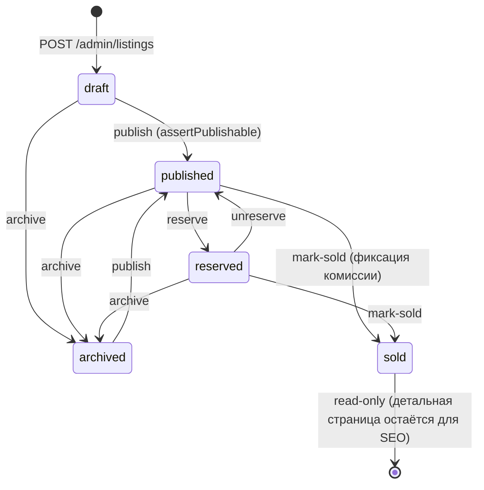
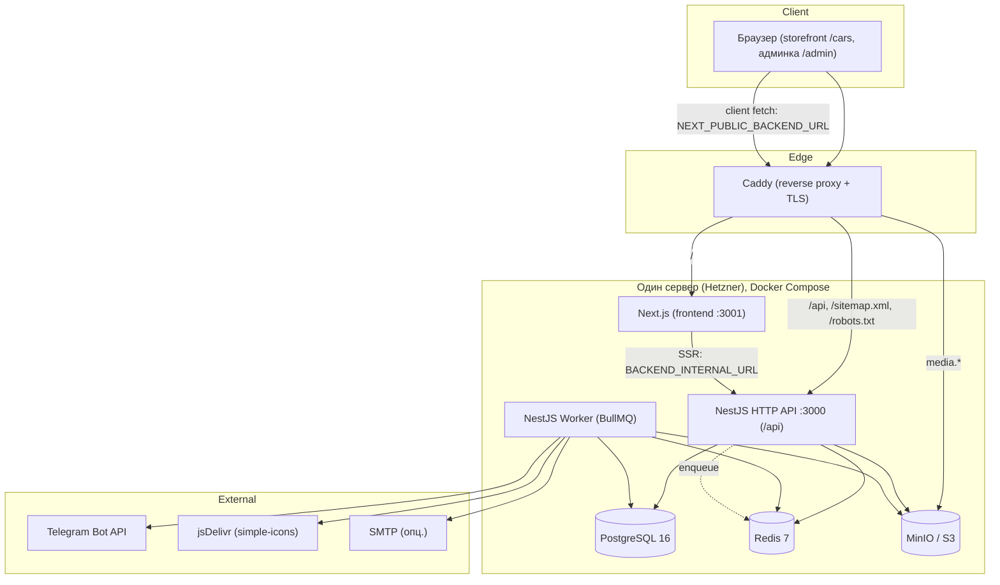

# AutoFlow — Agent Context (канонический контекст продукта)

> Единый самодостаточный документ для нового AI-агента. Прочитав только этот
> файл, агент должен понять систему целиком: назначение, бизнес-флоу, архитектуру,
> модули, API, модели данных, роли, frontend, конфигурацию, тесты и техдолг.

---

## Метаданные анализа

| Поле | Значение |
|------|----------|
| Продукт | **AutoFlow** — курируемая витрина объявлений о продаже авто для одного автосалона (single-tenant) |
| Дата анализа | **2026-08-17** |
| Проанализированный commit | `abe08303aad7b6ee20c333e365c9c758acaea818` (ветка `main`) |
| Заголовок коммита | `feat: competitor-parity pack — sell-your-car funnel, credit calculator, reviews, trust stats, SEO collections` |
| Версия backend | `1.0.0` (package.json, `name: autoflow-backend`) |
| Корень репозитория | `/Users/andreypavlenko/Desktop/Projects/AutoFlow` |
| Границы исследования | Прочитаны: backend (`src/`), frontend (`frontend/src/`), миграции, сиды, docker/deploy, CI/CD, тесты, конфиги. НЕ выполнялись: запуск приложения, чтение содержимого `node_modules`, архива `AutoFlow каталог авто.zip`, реальных значений `.env` (только `.env.example`). Значения enum/полей выверены по entity-файлам и миграциям. |
| Язык интерфейса | Украинский (единственная локаль; `frontend/messages/uk.json`) |

**Легенда достоверности** (используется в разделах ниже):

- ✅ **Подтверждено** — прочитано в коде/миграции/конфиге (указан путь).
- 🔷 **Окружение** — обнаружено в текущем dev-окружении/сидах.
- 🟡 **Предположение** — логичный вывод, не подтверждён напрямую.
- ❓ **UNKNOWN** — недостаточно данных, требуется проверка.

---

## Оглавление

1. [Quick Context](#quick-context)
2. [1. Общее описание продукта](#1-общее-описание-продукта)
3. [2. Основные бизнес-флоу](#2-основные-бизнес-флоу)
4. [3. Функциональные возможности](#3-функциональные-возможности)
5. [4. Архитектура системы](#4-архитектура-системы)
6. [5. Модули и структура кода](#5-модули-и-структура-кода)
7. [6. API и интеграции](#6-api-и-интеграции)
8. [7. Бизнес-модели и модели данных](#7-бизнес-модели-и-модели-данных)
9. [8. Пользователи, роли и права](#8-пользователи-роли-и-права)
10. [9. Frontend и пользовательский интерфейс](#9-frontend-и-пользовательский-интерфейс)
11. [10. Конфигурация и окружение](#10-конфигурация-и-окружение)
12. [11. Тестирование и качество](#11-тестирование-и-качество)
13. [12. Ошибки, ограничения и технический долг](#12-ошибки-ограничения-и-технический-долг)
14. [13. Глоссарий](#13-глоссарий)
15. [14. Карта связей](#14-карта-связей)
16. [15. Статус достоверности](#15-статус-достоверности)
17. [Instructions for a New Agent](#instructions-for-a-new-agent)

---

## Quick Context

**Что это.** AutoFlow — витрина подержанных/новых авто для одного автосалона. Публичная
часть (storefront) доступна без авторизации и показывает опубликованные объявления.
Заводит и ведёт объявления только персонал салона через админку. Поддерживается
консигнация (продажа авто клиентов с комиссией), мультивалютность, автопубликация
объявлений в Telegram-каналы, лиды (заявки), отзывы, аналитика.

**Стек.**
- **Backend:** NestJS 11 (TypeScript), модульный монолит. Два процесса из одного образа:
  HTTP API (`src/main.ts`) и BullMQ-воркер (`src/worker.ts`).
- **БД:** PostgreSQL 16, TypeORM 0.3, миграции (не `synchronize`). Роль-разделение:
  миграции/сиды под owner-ролью, рантайм — под low-privilege `app_user`.
- **Очереди/кеш:** Redis 7 + BullMQ 5 (очереди `notifications`, `media`, `views`,
  `maintenance`, `telegram`).
- **Хранилище:** S3-совместимое (MinIO в dev), `@aws-sdk/client-s3`, presigned upload,
  обработка изображений через `sharp` (vips).
- **Frontend:** Next.js 15 (App Router, React 19 RC), Tailwind, next-intl (uk),
  TanStack Query, zod. Отдельное приложение в `frontend/`, порт 3001.
- **Деплой:** один сервер (Hetzner), Docker Compose + Caddy (reverse proxy, TLS).
  CI/CD — GitHub Actions → Docker Hub → SSH-деплой.

**Ключевые факты для быстрой ориентировки.**
- Публичный API префикс: **`/api`** (глобальный prefix из `API_PREFIX`, `src/main.ts:20`).
  Например, публичный листинг: `GET /api/listings`, деталь: `GET /api/listings/:slug`.
- Публичные URL storefront используют **`/cars`**, а API — **`/listings`**. Это разные
  пространства: canonical и ссылки ведут на `/cars/[slug]`, данные берутся из `/api/listings/:slug`.
- Роли ровно две: **`admin`** (полный доступ) и **`editor`** (только объявления и лиды).
- Все сущности — **soft delete** (`deleted_at`), уникальность — через partial unique index
  `WHERE deleted_at IS NULL`. Оптимистичная блокировка — колонка `version`.
- Цена хранится в исходной валюте (`price_amount`+`price_currency`) и нормализованной
  (`price_normalized`) в базовой валюте сайта. Фильтр/сортировка по цене — только по
  нормализованной. Курсы v1 — статические из env (`FX_STATIC_*`).
- Swagger: `GET /api/docs`.
- Демо-логины (dev/seed): `admin@autoflow.example` / `Demo!Password12345` (admin),
  `editor@autoflow.example` / `Demo!Password12345` (editor, только dev).

**Не реализовано в v1:** логика `reservations` (только сущность+миграция; статус
`listing='reserved'` ставится вручную и не связан с таблицей `reservations`); импорт
фидов/парсинг (`source_type='feed'|'parser'` — только заглушка типа); Telegram-уведомления
менеджеров о заявках (публикация объявлений в каналы — реализована).

---

## 1. Общее описание продукта

### 1.1 Назначение

AutoFlow — программная витрина (каталог) автомобилей на продажу для **одного бизнеса**
(автосалона). Продукт закрывает две задачи:

1. **Публичная витрина (storefront)** — SEO-оптимизированный сайт, где покупатели ищут
   авто по фильтрам, смотрят детальные карточки с галереей и характеристиками, оставляют
   заявки (callback, сообщение, тест-драйв, «продай своё авто», кредит).
2. **Админка (back-office)** — персонал салона заводит объявления, загружает фото, управляет
   статусами (черновик → публикация → продано), обрабатывает лиды, настраивает брендинг,
   отзывы, команду, смотрит аналитику, публикует объявления в Telegram.

Источник: `README.md:1-5`, `package.json` (`description: "AutoFlow — curated car listings backend (modular monolith)"`).

### 1.2 Какую проблему решает

- Салону нужен собственный брендированный сайт-каталог без зависимости от маркетплейсов.
- Нужен единый процесс: приём авто (в т.ч. чужих — консигнация) → карточка → медиа →
  публикация → лиды → продажа с фиксацией комиссии → аналитика.
- Нужна автоматическая дистрибуция объявлений в Telegram-каналы.
- Нужна мультивалютность (USD/UAH/EUR) с корректной сортировкой по цене.

### 1.3 Основные пользователи и роли

| Тип | Кто | Доступ |
|-----|-----|--------|
| **Публичный посетитель** | Покупатель, аноним | Только storefront: просмотр опубликованных объявлений, отправка заявок. Без авторизации. |
| **editor** | Контент-менеджер салона | Админка: объявления (CRUD, статусы, медиа, Telegram-пост), лиды (список, смена статуса), создание make/model в справочнике. НЕ видит команду, брендинг, отзывы, audit, аналитику, остальной справочник. |
| **admin** | Владелец/администратор салона | Полный доступ: всё выше + брендинг (включая Telegram-токен), команда (admin-users), отзывы, audit log, аналитика, весь справочник (каталог). |

Источник: `README.md:30-34`, `src/app.module.ts` (guards), `src/modules/auth/roles.guard.ts`, контроллеры с `@Roles(...)`.

### 1.4 Ключевые бизнес-объекты

- **Listing** (объявление/авто) — ядро системы. Статусы: `draft → published → reserved →
  sold → archived`.
- **ListingMedia / MediaRendition** — фото/видео объявления и их обработанные версии.
- **Lead** (заявка) — обращение покупателя. Типы: `callback | message | test_drive |
  sell_request | credit`.
- **SiteSettings** (branding) — singleton с настройками сайта (лого, цвета, контакты, SEO,
  базовая валюта, Telegram-конфиг).
- **Catalog** — справочники: makes, models, body types, fuel types, transmissions, drive
  types, colors, vehicle options.
- **AdminUser** — учётка сотрудника (admin/editor).
- **Review** — отзыв клиента (для главной страницы).
- **AuditLog** — неизменяемый журнал действий.
- **ListingTelegramPost** — факт публикации объявления в конкретный Telegram-канал.
- **Reservation** — сущность бронирования (в v1 не используется логикой).

### 1.5 Границы системы (что входит / что снаружи)

**Входит в платформу:**
- Backend API (NestJS), фоновый воркер, PostgreSQL, Redis, S3-хранилище, Next.js storefront+админка,
  Caddy-прокси. Всё разворачивается на одном сервере через Docker Compose.

**Снаружи (внешние зависимости):**
- **Telegram Bot API** (`https://api.telegram.org`) — публикация объявлений в каналы.
- **simple-icons через jsDelivr CDN** (`https://cdn.jsdelivr.net/npm/simple-icons`) — логотипы
  марок авто.
- **Wikimedia Commons** — источник фото для демо-сидов (только dev, `seed-demo-cars.ts`).
- **SMTP-сервер** (опционально) — email-уведомления о лидах через nodemailer.
- **FX-курсы** — в v1 статические из env; внешний провайдер не подключён.
- **Let's Encrypt** — TLS-сертификаты через Caddy (в domain-режиме).

**Не является частью продукта:** платёжный процессинг (депозиты/оплаты не проводятся —
`reservations` не реализованы), CRM, импорт объявлений из внешних фидов, мобильные приложения.

---

## 2. Основные бизнес-флоу

Обозначения: 🎬 инициатор · 👥 участники · ⚙️ сервисы/очереди · 💥 побочные эффекты.

### 2.1 Flow: Создание и публикация объявления (end-to-end)

**Цель:** завести авто в каталог и вывести его в публичную витрину.
🎬 editor/admin · 👥 backend listings/media/telegram/fx, S3, воркер, Telegram.

**Предусловия:** пользователь авторизован (Bearer access-token), существуют справочники
(make/model/body/fuel/transmission/drive/color).

**Шаги:**

1. **Создание черновика.** `POST /api/admin/listings` с `CreateListingDto`.
   `ListingsService.create()` (`src/modules/listings/listings.service.ts`):
   - Валидирует консистентность консигнации (`assertConsignmentConsistent`) и каталожные
     ссылки (`assertCatalogRefs`: `model.makeId` должен совпадать с `makeId`).
   - Строит slug: `make.slug-model.slug-year` + при коллизии `nanoid(6)` (`SlugService.unique`).
   - Считает нормализованную цену: `FxRateProvider.convert(price_amount, price_currency,
     defaultCurrency)` → `price_normalized`, `fx_rate`, `fx_rate_at`.
   - Сохраняет со `status='draft'`, `source_type='manual'`. Если переданы `optionIds` —
     пишет строки `listing_options` в транзакции.
   - 💥 Audit: `listing.create`.
2. **Загрузка медиа** (см. flow 2.2). Нужно ≥1 фото со статусом `ready`.
3. **Публикация.** `POST /api/admin/listings/:id/publish` с `{ version, ... }`.
   `ListingsService.transition('publish', ...)`:
   - Проверка `version` (иначе 409), допустимость перехода (`draft|archived|reserved →
     published`, иначе 403).
   - `assertPublishable()` (иначе **422** со списком причин): есть ≥1 `image` со `status='ready'`;
     если `vin_visible=true` — задан `vin`; консигнация консистентна.
   - Первую публикацию помечает `published_at = now()` (повторная публикация из archived/reserved
     `published_at` не перезаписывает).
   - 💥 Audit: `listing.publish`. 💥 Если это **первая** публикация — `telegram.enqueueAutoPost(id)`
     (очередь `telegram`); ошибки проглатываются (best-effort).
4. **Telegram-автопост** (если в брендинге `telegram.autoPublish=true` и настроены каналы) —
   см. flow 2.4.

**Изменения состояния:** `listings.status: draft→published`, `published_at` заполнено.
**Ошибки:** 409 (version), 403 (недопустимый переход), 422 (не готово к публикации), 404 (нет объявления).
**Успех:** объявление видно на `/api/listings` и `/cars/[slug]`.



### 2.2 Flow: Загрузка и обработка медиа

**Цель:** привязать фото/видео к объявлению и сгенерировать оптимизированные рендишены.
🎬 editor/admin · 👥 media-сервис, S3, воркер `media`.
Источник: `README.md:109-121`, `src/modules/media/media.service.ts`, `src/workers/media-processor.worker.ts`.

1. `POST /api/admin/listings/:listingId/media` с `CreateMediaDto` (`type`, `contentType`,
   `filename`, `sizeBytes`). Сервис валидирует размер (`MEDIA_MAX_BYTES`), генерирует ключ
   `listings/{listingId}/original/{nanoid(16)}.{ext}`, создаёт `ListingMedia(status='pending')`
   и возвращает **presigned PUT URL**.
2. Клиент **PUT-ит файл напрямую в S3** по presigned URL.
3. `POST /api/admin/media/:id/confirm`. Сервис делает `HEAD` в S3 (проверка наличия/размера),
   сверяет MIME. Для **изображений**: `status='processing'` (до постановки в очередь, чтобы
   sweep не удалил), enqueue job `process` (jobId `media-{id}`, 3 попытки, backoff 5s).
   Для **видео**: проверяет magic-байты `ftyp`, сразу `status='ready'`.
   💥 Audit: `media.confirm`.
4. **Воркер** (`MediaProcessorWorker`, очередь `media`): читает оригинал, извлекает width/height
   через `sharp`, генерирует рендишены `thumb(320)|gallery(960)|full(1920)` × `webp|avif|jpeg`,
   пишет в `media_renditions`, ставит `status='ready'`. При ошибке — `status='failed'` +
   `failure_reason` (обрезка до 510 симв.).
5. **Cover/reorder:** `PATCH .../media/:mediaId/cover` (partial unique index гарантирует ≤1
   cover на объявление), `PATCH .../media/reorder` (полная перестановка позиций в транзакции).
6. **Удаление:** `DELETE /api/admin/media/:id` — отменяет job, удаляет оригинал+рендишены из S3,
   soft-delete строк. 💥 Audit: `media.delete`.
7. **Очистка (`MaintenanceWorker`, ежечасно):** orphan (`pending` старше `MEDIA_ORPHAN_TTL_HOURS`),
   `failed` старше TTL, и soft-deleted — удаляются вместе с S3-объектами (лимит 500/проход).

### 2.3 Flow: Продажа авто (mark-sold) и фиксация комиссии

**Цель:** зафиксировать продажу и комиссию салона.
🎬 editor/admin · 👥 listings, telegram, audit.
Источник: `README.md:54-63`, `src/modules/listings/listings.service.ts` (`commissionFor`, `transition`).

1. `POST /api/admin/listings/:id/mark-sold` с `{ version, salePriceAmount? }`.
2. Переход допустим из `published|reserved` (иначе 403). Проверка `version` (иначе 409).
3. `sale_price_amount = salePriceAmount ?? price_amount`. Расчёт `commission_amount`:
   - `fee_type='fixed'` → `fee_fixed_amount` (**422**, если не задано/≤0);
   - `fee_type='percent'` → `sale_price * fee_percent / 100` (**422**, если `fee_percent` не задано/≤0);
   - `fee_type='none'` → `0`.
   - Философия: отсутствие ставки — **жёсткая ошибка**, а не «молчаливый 0», чтобы опечатка
     не стёрла комиссию из аналитики (`README.md:59-60`).
4. Ставит `status='sold'`, `sold_at=now()`. 💥 Audit `listing.mark-sold`. 💥 `telegram.enqueueMarkSold(id)`.
5. Telegram-воркер редактирует подпись поста на «✅ ПРОДАНО» с зачёркнутой ценой.

**Изменения:** `status→sold`, `sale_price_amount`, `commission_amount`, `sold_at`. Проданное
объявление становится read-only (update → 403), но детальная страница остаётся доступной для SEO
(`findPublishedBySlug` возвращает и `sold`).

### 2.4 Flow: Публикация в Telegram-каналы

**Цель:** разослать объявление в каналы салона.
🎬 система (автопост) или editor/admin (ручная кнопка) · 👥 telegram-сервис, воркер `telegram`, Telegram Bot API.
Источник: `README.md:92-106`, `src/modules/telegram/*`, `src/workers/telegram.worker.ts`.

1. **Триггер:** первая публикация объявления (`enqueueAutoPost`, если `autoPublish=true`) ИЛИ ручной
   `POST /api/admin/listings/:id/telegram-posts` (202; постит только в каналы, где поста ещё нет).
2. Воркер `telegram` (concurrency=1, чтобы не гонять idempotency-строки): берёт токен из
   `site_settings.telegram.botToken`, для каждого канала формирует альбом до 10 фото (предпочтительно
   `gallery` JPEG) + подпись (год, пробіг, двигун, КПП, місто, ціна, ссылка).
3. Публикует через `sendMediaGroup`, записывает `listing_telegram_posts(listing, chat_id, message_ids,
   caption_message_id)`. **Идемпотентность:** partial-unique `(listing_id, chat_id) WHERE deleted_at IS NULL`.
4. При `mark-sold` — job `mark-sold`: `editMessageCaption` на «ПРОДАНО», проставляет `sold_marked_at`.
5. 💥 Audit: `listing.telegram_post`. Токен маскируется в audit и не отдаётся публичным/editor-API.

**Ограничение:** Telegram скачивает фото по URL → медиа-домен должен быть публично доступен
(на проде — да; с локального MinIO пост не пройдёт, `README.md:105-106`).

**Ошибки ручного эндпоинта:** 422 (Telegram не настроен / объявление не published-reserved),
404 (нет объявления), 409 (уже во всех каналах).

### 2.5 Flow: Отправка заявки (Lead) посетителем

**Цель:** покупатель оставляет обращение.
🎬 публичный посетитель · 👥 leads-сервис, Redis (rate limit), notification-очередь, email.
Источник: `src/modules/leads/leads.service.ts`, `src/modules/leads/dto/create-lead.dto.ts`.

1. `POST /api/leads` с `CreateLeadDto` (`type`, `name`, `phone`, опц. `email`, `message`,
   `listingId`, `sourceUrl`, `utm`, поля для `sell_request`/`credit`, honeypot `website`).
2. **Honeypot:** если `website` заполнено (бот) — сервис логирует и возвращает **фейковый успех**
   (байт-в-байт как настоящий: `{ id: <uuid>, status: 'new' }`), ничего не сохраняя.
3. **Rate limit** (Redis): по IP (`leads:rate:ip:{ip}`) и по нормализованному телефону
   (`leads:rate:phone:{digits}`), лимит `LEAD_RATE_PER_HOUR`/час → иначе `403`.
4. Если задан `listingId` — проверка, что объявление `published|reserved` и не удалено.
5. Создаёт `Lead(status='new')`: `message` собирается человекочитаемо из `details`; `ip_hash =
   sha256(ip)` (обрезка). 💥 Если задан `LEAD_NOTIFY_TO` — enqueue email-нотификации (очередь
   `notifications`).
6. `NotificationWorker` → `EmailChannel.send` (nodemailer). Без `SMTP_HOST` — только лог.

**Успех:** `201`-подобный ответ `{ id, status: 'new' }`. Заявка видна в `GET /api/admin/leads`.

### 2.6 Flow: Смена базовой валюты сайта (переоценка каталога)

**Цель:** сменить `default_currency` и переоценить все объявления.
🎬 admin · 👥 branding-сервис, fx, транзакция.
Источник: `README.md:42-52`, `src/modules/branding/branding.service.ts`.

1. `PATCH /api/admin/branding` с `{ defaultCurrency: <new> }`.
2. `BrandingService.update` замечает смену валюты → `computeRenormalizedPrices(base)`: для всех
   не удалённых объявлений считает новые `price_normalized`, `fx_rate`, `fx_rate_at` через FX.
3. **Валидация до записи:** все FX-пары должны существовать; отсутствие пары — abort (ничего не
   меняется).
4. **Одна транзакция:** применяет все обновления цен + сохраняет `site_settings`.
5. 💥 Audit: `branding.update` (при наличии `telegram.botToken` — маскируется `***`).

**Замечание:** курсы v1 статические из env — перед сменой базы нужно проверить их актуальность.

### 2.7 Flow: Аутентификация админа (login / refresh rotation / logout)

🎬 admin/editor · 👥 auth-сервис, Redis, argon2, JWT. Источник: `README.md:128-134`,
`src/modules/auth/*`.

1. `POST /api/auth/login` `{ email, password }`. Rate-limit по IP и email (`AUTH_LOGIN_RATE_PER_MIN`,
   60-сек Redis-бакеты). Проверка `locked_until`; при неверном пароле — инкремент
   `failed_login_attempts`, при достижении `AUTH_MAX_FAILED_ATTEMPTS` → `locked_until = now +
   AUTH_LOCKOUT_SECONDS`. Пароль — argon2id.
2. Успех: выдаёт **access** (stateless JWT, TTL `JWT_ACCESS_TTL`) и **refresh** (stateful в Redis).
   Refresh хранится как `sha256(token)` с записью `{ userId, role, email, family, ... }`.
3. `POST /api/auth/refresh` `{ refreshToken }`: старый токен денилистится, выдаётся новый в той же
   `family`. **Replay** того же refresh → revoke всей family + 401.
4. `POST /api/auth/logout` — revoke refresh (денилист + kill family).
5. Смена пароля/роли/деактивация/удаление админа → `revokeAllForUser` (все family) + отсечка access
   через `auth:min-iat:{userId}`.

### 2.8 Flow: Подсчёт просмотров объявления

🎬 публичный посетитель · 👥 views-сервис (Redis), воркер `views`. Источник: `README.md:122-126`,
`src/modules/views/view-counter.service.ts`, `src/workers/views-flush.worker.ts`.

1. Клиент на детальной странице шлёт beacon `POST /api/listings/:id/view`.
2. `ViewCounterService.track(id, ip)`: дедуп по IP через `SET NX EX` (`VIEW_DEDUP_TTL_SECONDS`),
   затем `HINCRBY views:pending {id} 1`.
3. `ViewsFlushWorker` (интервал `VIEW_FLUSH_INTERVAL_SECONDS`): атомарно `HGETALL`+`DEL` через Lua,
   в транзакции `UPDATE listings SET views_count = views_count + delta`. При ошибке — restore дельт.

---

## 3. Функциональные возможности

Статусы: **✅ реализовано**, **🟨 частично**, **⛔ не реализовано (заглушка)**, **❓ unknown**.

| Фича | Назначение | Пользователи | Флоу | Frontend | Backend-модуль | API (префикс `/api`) | Модели | Статус |
|------|-----------|--------------|------|----------|----------------|-----|--------|--------|
| Публичный каталог с фильтрами | Поиск авто по фасетам, курсорная пагинация | посетитель | 2.1 | `(public)/cars/page.tsx`, `filters/*`, `listing-card` | listings | `GET /listings` | Listing | ✅ |
| Детальная карточка авто | Галерея, характеристики, опции, похожие, форма заявки, JSON-LD | посетитель | 2.1/2.5/2.8 | `(public)/cars/[slug]/page.tsx`, `listing/*` | listings, views | `GET /listings/:slug`, `POST /listings/:id/view` | Listing, ListingMedia | ✅ |
| Заявки (лиды) | callback/message/test_drive/sell_request/credit | посетитель, editor/admin | 2.5 | `lead/lead-form`, `sell-car-form`, `contacts` | leads, notifications | `POST /leads`, `GET /admin/leads`, `PATCH /admin/leads/:id/status` | Lead | ✅ |
| Кредитный калькулятор | Оценка платежа + заявка `credit` | посетитель | 2.5 | `listing/credit-calculator.tsx` | leads | `POST /leads` (`type=credit`) | Lead.details | ✅ |
| «Продай своё авто» | Воронка приёма авто у клиента | посетитель | 2.5 | `lead/sell-car-form`, `home/sell-car-section` | leads | `POST /leads` (`type=sell_request`) | Lead.details | ✅ |
| Отзывы клиентов | Витрина отзывов на главной | посетитель, admin | — | `home/reviews-section`, `admin/reviews/*` | reviews | `GET /reviews`, `GET/POST/PATCH/DELETE /admin/reviews` | Review | ✅ |
| Trust-статистика | Счётчики available/sold/views на главной | посетитель | — | `home/stats-band` | analytics | `GET /stats` | Listing (агрегат) | ✅ |
| SEO-коллекции | Курируемые лендинги-пресеты фильтров | посетитель | — | `(public)/collections/[key]`, `home/collections-section` | (frontend `lib/collections.ts`) + sitemap | (использует `GET /listings`) | Listing | ✅ (5 пресетов хардкод) |
| Управление объявлениями | CRUD, статусы, консигнация, мультивалюта | editor/admin | 2.1/2.3 | `admin/listings/*`, `listing-form`, `transition-menu` | listings, fx, slug | `GET/POST/PATCH/DELETE /admin/listings`, transitions | Listing, ListingOption | ✅ |
| Медиа-менеджер | presigned upload, рендишены, cover, reorder | editor/admin | 2.2 | `admin/media/*` | media | `POST .../media`, `POST /admin/media/:id/confirm`, reorder, cover, delete | ListingMedia, MediaRendition | ✅ |
| Публикация в Telegram | Автопост + ручная кнопка | система, editor/admin | 2.4 | `admin/listings/telegram-post-panel` | telegram | `POST/GET /admin/listings/:id/telegram-posts` | ListingTelegramPost | ✅ |
| Мультивалютность | USD/UAH/EUR, нормализация цены | editor/admin | 2.1/2.6 | `listing-form` (валюта) | fx, listings, branding | (внутри listings/branding) | Listing.price_* | ✅ (курсы статические) |
| Консигнация | Продажа авто клиента + комиссия | editor/admin | 2.1/2.3 | `listing-form` (fees) | listings | (внутри listings) | Listing.seller_*/fee_* | ✅ |
| Брендинг сайта | Лого, цвета, контакты, SEO, валюта, Telegram | admin | 2.6 | `admin/branding/*`, `branding-editor` | branding | `GET /branding`, `GET/PATCH /admin/branding` | SiteSettings | ✅ |
| Справочники (каталог) | makes/models/body/fuel/… + логотипы марок | admin (+ editor: make/model) | — | `listings/catalog-combobox` | catalog | `GET /catalog/*`, `POST/PATCH/DELETE /admin/catalog/*` | Make, Model, … | ✅ |
| Логотипы марок | Моно-иконки simple-icons в S3 | система | — | `listing/make-logo-strip` | catalog (make-logo) | (фон, очередь `maintenance`) | Make.logo_s3_key | ✅ |
| Команда (admin-users) | CRUD сотрудников, роли | admin | 2.7 | `admin/team/*` | admin-users | `GET/POST/PATCH/DELETE /admin/users` | AdminUser | ✅ |
| Аудит-лог | Кто-что-когда, только чтение | admin | — | `admin/audit/*` | audit | `GET /admin/audit` | AuditLog | ✅ |
| Аналитика (дашборд) | Продажи, комиссии, лиды, топ-просмотры | admin | — | `admin/(dashboard)/page` | analytics | `GET /admin/analytics/summary` | Listing, Lead (агрегаты) | ✅ |
| Просмотры объявлений | Счётчик с дедупом | посетитель | 2.8 | `listing/view-beacon` | views | `POST /listings/:id/view` | Listing.views_count | ✅ |
| Sitemap / robots | SEO | поисковики | — | (проксируется из backend) | sitemap | `GET /sitemap.xml`, `GET /robots.txt` | Listing | ✅ |
| Избранное | localStorage, гостевое | посетитель | — | `favorites`, `favorite-button` | — (только frontend) | — | ✅ (без backend) |
| Тёмная тема | Переключатель темы | посетитель | — | `theme/*` | — | — | ✅ |
| Бронирования (депозиты) | Hold авто с депозитом | — | — | — | reservations | — | ⛔ только сущность+миграция |
| Импорт фидов/парсинг | Загрузка объявлений извне | — | — | — | listings (`source_type`) | — | ⛔ только заглушка типа |
| Telegram-уведомления о лидах | Оповещение менеджеров в Telegram | — | — | — | notifications (`NotificationChannel`) | — | ⛔ только интерфейс (email реализован) |

---

## 4. Архитектура системы

### 4.1 Архитектурный стиль

**Модульный монолит** на NestJS (feature-модули с чёткими границами), запускаемый в **двух
процессах из одного Docker-образа**:
- **HTTP API** (`src/main.ts` → `AppModule`) — обслуживает REST.
- **Worker** (`src/worker.ts` → `WorkerModule`) — обрабатывает BullMQ-очереди.

Frontend — отдельное приложение Next.js (`frontend/`), общается с backend по HTTP.



### 4.2 Слои и границы ответственности

- **Controller** — HTTP, DTO-валидация (`class-validator`), маппинг ответов (`listings.mapper.ts`).
- **Service** — бизнес-логика, транзакции, вызовы других сервисов и постановка job'ов.
- **Entity/Repository** — TypeORM-сущности и доступ к данным.
- **Worker** — асинхронная обработка (media, telegram, notifications, views, maintenance).
- **Common** — logger (pino), redis, декораторы (`@Public`/`@Roles`/`@CurrentUser`), фильтр
  ошибок, курсорная пагинация, типы.

### 4.3 Синхронные vs асинхронные взаимодействия

- **Синхронно (HTTP):** весь CRUD, чтение витрины, транзакции статусов, presigned upload.
- **Асинхронно (BullMQ/Redis):** обработка изображений, Telegram-постинг, email-нотификации,
  flush просмотров, обслуживание (orphan-cleanup + логотипы марок).

### 4.4 Очереди, cron и воркеры

| Очередь (`src/workers/queue.tokens.ts`) | Воркер | Что делает | Расписание |
|------|--------|-----------|-----------|
| `media` | `MediaProcessorWorker` | генерация рендишенов thumb/gallery/full × webp/avif/jpeg | по событию (confirm) |
| `telegram` | `TelegramWorker` | `post` / `mark-sold` в каналы (concurrency 1) | по событию |
| `notifications` | `NotificationWorker` | отправка email через канал | по событию |
| `views` | `ViewsFlushWorker` | flush Redis-дельт в `listings.views_count` | repeat `VIEW_FLUSH_INTERVAL_SECONDS` |
| `maintenance` | `MaintenanceWorker` | `orphan-cleanup` (медиа) + `make-logo` (логотипы) + sweep пропущенных логотипов | repeat ежечасно + по событию |

Cron реализован через `queue.upsertJobScheduler()` в `onModuleInit()` соответствующих воркеров
(`views-flush` и `maintenance`).

### 4.5 Кеширование

- **Каталог:** Redis, префикс `catalog:`, TTL 600s; инвалидация через SCAN/DEL после любой мутации
  (`CatalogService`).
- **FX-курсы:** Redis, ключ `fx:{from}:{to}`, TTL `FX_CACHE_TTL`.
- **Просмотры:** Redis hash `views:pending` (write-behind), дедуп `views:seen:*`.
- **Frontend (Next.js):** ISR/`revalidate` + tag-based invalidation (`listings`, `branding`,
  `catalog:makes`, …); admin — `cache: 'no-store'`.

### 4.6 Хранение файлов

S3-совместимое хранилище (MinIO в dev). Ключи:
- Оригиналы: `listings/{listingId}/original/{nanoid}.{ext}`.
- Рендишены: пути `.../r/{variant}.{format}` (thumb/gallery/full × webp/avif/jpeg).
- Логотипы марок: `catalog/makes/{slug}.png`.

Публичные ссылки — через `S3_PUBLIC_URL` (на проде — приватный бакет за Caddy/CDN, immutable cache
headers). Presigned PUT TTL — `S3_PRESIGNED_PUT_TTL`.

### 4.7 Авторизация и аутентификация

- Глобальные guards (порядок в `src/app.module.ts:76-78`): `JwtAuthGuard` → `RolesGuard` →
  `ThrottlerGuard`.
- Любой роут без `@Public()` требует Bearer access-token. `@Roles('admin'|'editor')` уточняет доступ.
- Refresh-токены — stateful в Redis с ротацией и family-revocation (см. 2.7).
- Frontend хранит сессию в **подписанной HMAC-cookie** (`autoflow_admin`), обновление токенов —
  через Route Handlers (`/admin/api/token`, `/admin/refresh`).

### 4.8 Точки входа

- `src/main.ts` — HTTP API (prefix `/api`, CORS-allowlist, Swagger `/api/docs`, trust proxy из env,
  query parser `extended`).
- `src/worker.ts` — воркер (без HTTP).
- `frontend` — Next.js (`next start -p 3001`, output `standalone`).
- Caddy — единая точка входа: `/api`,`/sitemap.xml`,`/robots.txt` → backend; `/` → frontend;
  `media.*` → MinIO.

### 4.9 Процесс развёртывания

Один сервер (Hetzner), `deploy/docker-compose.prod.yml` + `deploy/Caddyfile`. GitHub Actions
(`.github/workflows/deploy.yml`): тесты → сборка/пуш образов в Docker Hub → SSH-деплой (миграции
`migration:run:prod` → `up -d` → `caddy reload` → `seed:prod` идемпотентно → smoke-test). Секреты
генерируются один раз на сервере (`openssl rand`), deploy-переменные ресинкаются из GitHub Variables.

---

## 5. Модули и структура кода

### 5.1 Backend (`src/`)

```
src/
  main.ts                  # HTTP entrypoint (prefix /api, CORS, Swagger)
  worker.ts                # Worker entrypoint (BullMQ)
  app.module.ts            # HTTP-композит (все feature-модули + глобальные guards/pipe/filter)
  worker.module.ts         # композит воркера (Config, Common, Bull, DB, Storage, Fx, Views, Notification, Workers)
  config/                  # env.validation.ts (+ .spec), config.module.ts
  common/                  # logger(pino), redis, decorators, filters, pagination(cursor), db, types
  bull/                    # bull.module.ts (BullRootModule на Redis)
  database/
    base/base.entity.ts    # id, createdAt, updatedAt, deletedAt, version
    data-source.ts         # owner DataSource для CLI/миграций/сидов
    entities.ts            # реестр всех сущностей
    migrations/            # 6 миграций (см. §7.4)
    seeds/run-seeds.ts     # справочники + site_settings + admin(+editor dev) + demo listings
    seeds/demo/            # seed-demo-cars.ts + demo-cars.data.ts + media-ingest + wiki-photos
  modules/<feature>/       # см. таблицу ниже
  workers/                 # media-processor, telegram, notification, views-flush, maintenance, queue.tokens, workers.module
```

| Модуль | Путь | Назначение | Публичный интерфейс (сервисы/эндпоинты) | Зависимости | Связанные флоу |
|--------|------|-----------|------|-------------|----------------|
| **listings** | `src/modules/listings` | Ядро: CRUD, статусы, публичное чтение, мультивалюта, консигнация | `ListingsService`; `listings-public.controller`, `listings-admin.controller` | fx, slug, branding, audit, telegram, views, storage, catalog | 2.1, 2.3 |
| **media** | `src/modules/media` | presigned upload, confirm, cover/reorder, delete | `MediaService`; `media-admin.controller` | storage, audit, очередь `media` | 2.2 |
| **catalog** | `src/modules/catalog` | справочники + логотипы марок | `CatalogService`, `CatalogAdminService`, `MakeLogoService`; public/admin controllers | redis, storage, audit, очередь `maintenance` | — |
| **leads** | `src/modules/leads` | публичный приём заявок, админ-список/статус | `LeadsService`; public/admin controllers | redis (rate), notifications, audit | 2.5 |
| **branding** | `src/modules/branding` | singleton site_settings, переоценка при смене валюты | `BrandingService`; public/admin controllers | fx, audit | 2.6 |
| **auth** | `src/modules/auth` | login/refresh/logout, guards | `AuthService`, `AuthTokenService`, `JwtAuthGuard`, `RolesGuard` | redis, argon2, jwt, admin-users | 2.7 |
| **admin-users** | `src/modules/admin-users` | CRUD сотрудников | `AdminUsersService`; controller | auth (revoke), audit | 2.7 |
| **audit** | `src/modules/audit` | неизменяемый журнал + чтение | `AuditLogService`; admin controller | — | все мутации |
| **telegram** | `src/modules/telegram` | постинг в каналы, история | `TelegramPostService`, `TelegramApiClient`; admin controller | branding (token), storage, audit, очередь `telegram` | 2.4 |
| **notifications** | `src/modules/notifications` | абстракция каналов + email | `NotificationService`, `EmailChannel` | nodemailer, очередь `notifications` | 2.5 |
| **fx** | `src/modules/fx` | курсы валют (статические) | `FxRateProvider` | redis | 2.1, 2.6 |
| **storage** | `src/modules/storage` | S3-абстракция, presigned | `StorageService` | @aws-sdk/client-s3 | 2.2 |
| **views** | `src/modules/views` | счётчик просмотров (Redis) | `ViewCounterService` | redis, очередь `views` | 2.8 |
| **reviews** | `src/modules/reviews` | отзывы клиентов | `ReviewsService`; public/admin controllers | audit | — |
| **analytics** | `src/modules/analytics` | дашборд + публичные счётчики | `AnalyticsService`; admin + `stats-public` controllers | — | — |
| **sitemap** | `src/modules/sitemap` | sitemap.xml / robots.txt | `SitemapService`; controller | (PUBLIC_SITE_URL) | — |
| **slug** | `src/modules/slug` | генерация уникальных slug | `SlugService` | — | 2.1 |
| **reservations** | `src/modules/reservations` | ⛔ только сущность (не используется логикой) | — | — | — |

**Техдолг/ограничения модулей:** `reservations` — мёртвая сущность (schema-ready, но нет сервиса/
контроллера); `source_type='feed'/'parser'` — заглушка без импортёров; email — единственный
реализованный `NotificationChannel`.

### 5.2 Frontend (`frontend/src/`)

```
frontend/src/
  app/
    (public)/         # storefront: layout + page(/), cars, cars/[slug], collections/[key], about, contacts, favorites
    (admin)/          # admin: login, api/token, refresh, (dashboard)/{page, listings, leads, reviews, team, branding, audit}
    not-found.tsx, llms.txt/route.ts
  components/         # nav, hero, home, filters, listing, lead, admin/*, ui/*, theme, motion (≈68 tsx)
  lib/
    api/              # client.ts, public.ts, admin.ts, types.ts
    auth/             # session.ts (HMAC-cookie), refresh.ts, actions.ts
    admin/            # listing-form-schema (zod), lockout, cursor-stack, audit-format, ...
    branding/         # resolve.ts (React.cache), theme.ts (CSS-переменные)
    collections.ts    # 5 пресетов SEO-коллекций (синхронизировать с backend sitemap!)
    format.ts, working-hours.ts, favorites.tsx, seo/json-ld.tsx, ...
  i18n/request.ts     # next-intl, locale 'uk'
  messages/uk.json    # все строки UI (украинский)
```

---

## 6. API и интеграции

**Тип:** REST (NestJS). **Глобальный префикс:** `/api`. **Auth:** Bearer access-token (кроме
`@Public`). **Swagger:** `GET /api/docs`. **Формат ошибок** (`HttpExceptionFilter`):
`{ statusCode, error, message, correlationId, path }`. **Пагинация:** keyset/cursor
(`{ items, nextCursor, total }`), курсор — base64url `{ k, i }`.

> Идемпотентность: явных Idempotency-Key нет. Идемпотентны по своей природе: `POST /admin/media/:id/confirm`
> (повторный confirm ready-медиа — no-op), Telegram-постинг (partial-unique `(listing,chat)`), сиды.
> Мутации объявлений защищены оптимистичной блокировкой (`version`), а не идемпотентностью.

### 6.1 Публичные эндпоинты (`@Public()`)

| Метод | Путь | Назначение | Параметры | Ответ | Побочные эффекты |
|-------|------|-----------|-----------|-------|------------------|
| GET | `/api/listings` | список опубликованных | query: `q, make, model, bodyType, fuelType, transmission, driveType, city, condition, priceMin/Max, yearMin/Max, mileageMax, options[], sort, cursor, limit(≤100, def 24)` | `{ items: PublicListing[], nextCursor, total }` | — |
| GET | `/api/listings/:slug` | деталь по slug | path `slug` | `PublicListing` (включая `sold` для SEO) | — |
| POST | `/api/listings/:id/view` | beacon просмотра | path `id`, IP | `204` | Redis `HINCRBY` (best-effort) |
| POST | `/api/leads` | отправка заявки | `CreateLeadDto` (+honeypot `website`) | `{ id, status:'new' }` | rate-limit, email-нотификация |
| GET | `/api/catalog/makes` | марки (+`logoUrl`) | — | `CatalogMake[]` | — |
| GET | `/api/catalog/models` | модели | query `make?` (slug) | `CatalogModel[]` | — |
| GET | `/api/catalog/body-types` \| `/fuel-types` \| `/transmissions` \| `/drive-types` \| `/colors` \| `/options` | справочники | — | `CatalogRef[]` | — |
| GET | `/api/branding` | брендинг витрины (без telegram) | — | `Branding` | — |
| GET | `/api/reviews` | опубликованные отзывы (≤12) | — | `PublicReview[]` | — |
| GET | `/api/stats` | публичные счётчики | — | `{ available, sold, views }` | — |
| GET | `/sitemap.xml` | sitemap | — | XML | — |
| GET | `/robots.txt` | robots (разрешает AI-краулеров, запрещает `/admin`) | — | text | — |

> `sitemap.xml` и `robots.txt` монтируются на корень (без `/api`) и на проде проксируются Caddy из
> backend. В коде backend — модуль `sitemap`.

### 6.2 Админские эндпоинты (Bearer + `@Roles`)

**Listings** (`@Roles('admin','editor')`, кроме DELETE):

| Метод | Путь | Роль | Назначение |
|-------|------|------|-----------|
| GET | `/api/admin/listings` | admin,editor | список всех (фильтр `status`, `q` ищет по title+VIN), cursor |
| GET | `/api/admin/listings/:id` | admin,editor | деталь (с back-office полями) |
| POST | `/api/admin/listings` | admin,editor | создать (draft), `CreateListingDto` |
| PATCH | `/api/admin/listings/:id` | admin,editor | обновить, `UpdateListingDto` (нужен `version`) |
| DELETE | `/api/admin/listings/:id` | **admin** | soft-delete (объявление+медиа) |
| POST | `/api/admin/listings/:id/publish` | admin,editor | draft/archived/reserved → published (422 если не готово) |
| POST | `/api/admin/listings/:id/archive` | admin,editor | → archived |
| POST | `/api/admin/listings/:id/mark-sold` | admin,editor | → sold (+`salePriceAmount?`, фиксация комиссии) |
| POST | `/api/admin/listings/:id/reserve` | admin,editor | published → reserved |
| POST | `/api/admin/listings/:id/unreserve` | admin,editor | reserved → published |

**Media** (`@Roles('admin','editor')`): `POST /api/admin/listings/:listingId/media`,
`POST /api/admin/media/:id/confirm`, `PATCH /api/admin/listings/:listingId/media/reorder`,
`PATCH /api/admin/listings/:listingId/media/:mediaId/cover`, `DELETE /api/admin/media/:id`.

**Telegram** (`@Roles('admin','editor')`): `POST /api/admin/listings/:id/telegram-posts` (202,
enqueue), `GET /api/admin/listings/:id/telegram-posts` (история).

**Leads** (`@Roles('admin','editor')`): `GET /api/admin/leads` (cursor, фильтр `status`, limit≤200),
`PATCH /api/admin/leads/:id/status`.

**Catalog** (`@Roles('admin')`, кроме create make/model — `admin,editor`):
`POST /api/admin/catalog/makes` (admin,editor; ставит job логотипа),
`PATCH|DELETE /api/admin/catalog/makes/:id` (admin), аналогично `models`,
`POST /api/admin/catalog/{body-types,fuel-types,transmissions,drive-types,colors,options}` (admin).
DELETE make/model — только если нет зависимых (иначе 409).

**Branding** (`@Roles('admin')`; editor может читать без telegram): `GET /api/admin/branding`,
`PATCH /api/admin/branding` (admin; смена `defaultCurrency` → переоценка каталога).

**Reviews** (`@Roles('admin')`): `GET/POST /api/admin/reviews`, `PATCH|DELETE /api/admin/reviews/:id`.

**Team / admin-users** (`@Roles('admin')`): `GET/POST /api/admin/users`,
`PATCH|DELETE /api/admin/users/:id`. Self-guards: нельзя менять свою роль/деактивировать/удалить
себя; нельзя убрать последнего активного admin.

**Audit** (`@Roles('admin')`): `GET /api/admin/audit` (фильтры `entityType, entityId, action`,
cursor, limit≤200).

**Analytics** (`@Roles('admin')`): `GET /api/admin/analytics/summary`.

**Auth** (`@Public()`): `POST /api/auth/login`, `POST /api/auth/refresh`, `POST /api/auth/logout`.

### 6.3 Внешние интеграции

| Интеграция | Направление | Модуль | Особенности |
|-----------|-------------|--------|-------------|
| **Telegram Bot API** | исходящее | telegram | токен из `site_settings.telegram`; `sendMediaGroup`/`editMessageCaption`; timeout 30s; токен не логируется |
| **simple-icons (jsDelivr)** | входящее | catalog/make-logo | SVG→PNG 512px через sharp; кандидаты slug; timeout 15s; ретрай раз в неделю |
| **Wikimedia Commons** | входящее | seeds/demo | только dev-сиды фото |
| **SMTP (nodemailer)** | исходящее | notifications | опционально (`SMTP_HOST`); без него — только лог |
| **FX** | — | fx | v1 статические курсы из env (нет внешнего API) |
| **Let's Encrypt** | — | Caddy | авто-TLS в domain-режиме |

**Webhooks/события/внешние очереди:** входящих webhook'ов нет. Внутренние события — через BullMQ
(Redis). Публичных исходящих webhook'ов нет. OAuth — нет (собственный JWT).

---

## 7. Бизнес-модели и модели данных

Базовые колонки всех сущностей (`src/database/base/base.entity.ts`): `id` (uuid PK),
`created_at`, `updated_at`, `deleted_at` (nullable, soft delete), `version` (int, оптимистичная
блокировка). Исключения: `listing_options` (join, без BaseEntity), `audit_logs` (append-only,
без `updated_at`/`deleted_at`).

### 7.1 Listing (таблица `listings`) — ядро

**Enum'ы:** `status: draft|published|reserved|sold|archived`; `condition: new|used|damaged`;
`price_currency: USD|UAH|EUR`; `source_type: manual|feed|parser`; `seller_type: own|client`;
`fee_type: none|fixed|percent`.

**Ключевые поля** (см. `src/modules/listings/entities/listing.entity.ts` и миграцию InitialSchema):
- Идентификация: `slug` (varchar128, unique alive), `status` (def `draft`).
- Каталог (FK ON DELETE RESTRICT, NOT NULL): `make_id, model_id, body_type_id, fuel_type_id,
  transmission_id, drive_type_id, color_id`.
- Характеристики: `generation?, modification?, year, mileage_km, vin?(17), vin_visible(def false),
  engine_volume_l numeric(3,1), power_hp, condition, owners_count(def 1), is_crashed(def false),
  customs_cleared(def true)`.
- Цена: `price_amount numeric(12,2), price_currency, price_normalized numeric(14,2), fx_rate
  numeric(12,6)?, fx_rate_at?, is_negotiable(def false)`.
- Консигнация: `seller_type(def own), seller_name?, seller_phone?, fee_type(def none), fee_percent
  numeric(5,2)?, fee_fixed_amount numeric(12,2)?, sale_price_amount?, commission_amount?`.
- Контент/SEO: `title(8..255), description(20..10000), location_city, location_region?, meta_title?,
  meta_description?(320)`.
- Источник: `source_type(def manual), external_id?`.
- Метрики/lifecycle: `views_count(def 0), published_at?, sold_at?`.

**Правила состояния:** переходы — `publish{draft,archived,reserved}`, `archive{draft,published,
reserved}`, `mark-sold{published,reserved}`, `reserve{published}`, `unreserve{reserved}`.
`assertPublishable`: ≥1 ready-фото, VIN при `vin_visible`, консистентная консигнация.
**Источник истины:** таблица `listings`. Публичный маппер скрывает back-office поля (fees,
контакты продавца — только пока не продано), VIN — только при `vin_visible`.

**Индексы:** `uq_listings_slug_alive`, `ix_listings_status_published`, `ix_listings_make_model`,
`ix_listings_price (WHERE published & alive)`, `ix_listings_published_id`, `ix_listings_created_id`,
`ix_listings_external (WHERE external_id NOT NULL)`. Check-constraints на статусы/валюту/год/пробег/цену.

### 7.2 Медиа

- **ListingMedia** (`listing_media`): `listing_id (FK CASCADE)`, `type: image|video`,
  `original_s3_key`, `status: pending|processing|ready|failed`, `width?, height?, size_bytes?,
  mime?, position(def 0), is_cover(def false), alt?, failure_reason?`. Индексы:
  `ix_listing_media_listing_position`, `ix_listing_media_status`, `uq_listing_media_cover`
  (partial unique `(listing_id) WHERE is_cover AND alive` → ≤1 cover).
- **MediaRendition** (`media_renditions`): `media_id (FK CASCADE)`, `variant: thumb|gallery|full`,
  `format: webp|avif|jpeg`, `s3_key`, `width, height, size_bytes`. Unique `(media_id, variant, format)`.
- **ListingOption** (`listing_options`, join): PK `(listing_id, option_id)`; `listing_id`
  (FK CASCADE), `option_id` (FK RESTRICT); индекс `ix_listing_options_option`.

### 7.3 Остальные сущности (кратко)

| Сущность / таблица | Ключевые поля | Enum/состояния | Заметки |
|--------------------|---------------|----------------|---------|
| **Lead** / `leads` | `listing_id? (FK SET NULL), type, name, phone, email?, message?, details jsonb?, status, source_url?, utm jsonb?, ip_hash?` | `type: callback|message|test_drive|sell_request|credit`; `status: new|in_progress|done|spam` | `details`: carMake/Model/Year/MileageKm, creditDownPayment/TermMonths |
| **SiteSettings** / `site_settings` | `logo_url?, favicon_url?, primary_color(def #0F172A), accent_color(def #2563EB), display_name, tagline?, contact_phone?, contact_email?, address?, working_hours jsonb?, social_links jsonb?, seo_defaults jsonb?, default_currency(def USD), telegram jsonb?` | — | Singleton (`uq_site_settings_singleton`); `telegram` — секрет, не отдаётся public/editor |
| **AdminUser** / `admin_users` | `email(unique alive), password_hash(argon2id, select:false), role, is_active(def true), last_login_at?, failed_login_attempts(def 0), locked_until?` | `role: admin|editor` | Брутфорс-защита |
| **Make** / `catalog_makes` | `name_uk, name_en?, slug(unique alive), logo_s3_key?, logo_checked_at?` | — | Логотипы через maintenance |
| **Model** / `catalog_models` | `make_id(FK CASCADE), name_uk, name_en?, slug` | — | unique `(make_id, slug)` alive |
| **BodyType/FuelType/Transmission/DriveType** | `name_uk, name_en?, slug(unique alive)` | — | однотипные справочники |
| **Color** / `catalog_colors` | `+ hex?` | — | |
| **VehicleOption** / `catalog_vehicle_options` | `category, name_uk, name_en?, slug` | `category: comfort|safety|multimedia|interior|exterior|other` | |
| **Review** / `reviews` | `author_name, city?, text, rating(def 5,1..5), is_published(def true), position(def 0)` | — | `ix_reviews_published_position` |
| **ListingTelegramPost** / `listing_telegram_posts` | `listing_id(FK CASCADE), chat_id, message_ids jsonb, caption_message_id, sold_marked_at?` | — | unique `(listing_id, chat_id)` alive (идемпотентность) |
| **AuditLog** / `audit_logs` | `actor_id?, actor_role?, action, entity_type, entity_id?, diff jsonb?, correlation_id?, created_at` | — | append-only; app_user не может UPDATE/DELETE |
| **Reservation** / `reservations` | `listing_id(FK CASCADE), customer_name, customer_phone, deposit_amount, deposit_currency, status, expires_at?` | `status: pending|confirmed|cancelled|expired` | ⛔ не используется логикой v1 |

### 7.4 Миграции (`src/database/migrations/`)

| Порядок | Файл | Содержание |
|---------|------|-----------|
| 1 | `1718000000000-InitialSchema.ts` | все базовые таблицы, индексы, check-constraints, роль-грант (app_user не UPDATE/DELETE audit) |
| 2 | `1783990000000-AddConsignmentFields.ts` | `listings`: seller_*/fee_*/sale_price_amount/commission_amount |
| 3 | `1784150000000-AddReviews.ts` | таблица `reviews`; расширение CHECK `leads.type` |
| 4 | `1784300000000-AddLeadDetails.ts` | `leads.details jsonb` |
| 5 | `1784400000000-AddTelegramPublishing.ts` | таблица `listing_telegram_posts`; `site_settings.telegram jsonb` |
| 6 | `1784500000000-AddMakeLogos.ts` | `catalog_makes.logo_s3_key`, `logo_checked_at` |

**DataSource** (`src/database/data-source.ts`): owner-роль (`DB_ADMIN_USER`), `synchronize:false`,
`migrationsTableName: typeorm_migrations`. Рантайм ходит под `DB_APP_USER` (создаётся
`docker/postgres/init/01-roles.sh` с грантами SELECT/INSERT/UPDATE/DELETE, без DDL).

### 7.5 DTO / модели frontend и расхождения

- **DTO backend** — `class-validator` (см. `src/modules/*/dto/*`). **Схема формы объявления
  frontend** — zod (`frontend/src/lib/admin/listing-form-schema.ts`) с кросс-полевой валидацией
  консигнации (дублирует доменные правила).
- **Типы frontend** (`frontend/src/lib/api/types.ts`) зеркалят ответы backend: `PublicListing`
  (без back-office), `AdminListing` (с fees/контактами продавца/комиссией). `PublicListing.price`
  — объект `{ amount, currency, normalized, isNegotiable }`; в БД это плоские колонки.
- **Расхождение имён:** API-ресурс `listings` ↔ публичные URL `/cars`. Держать в голове при
  навигации.

---

## 8. Пользователи, роли и права

### 8.1 Типы и роли

- **Аноним** — только `@Public()` эндпоинты (витрина, заявки, каталог, брендинг, отзывы, stats,
  sitemap/robots, view-beacon).
- **editor** — админка: listings (CRUD, статусы, медиа, Telegram-пост), leads (список, статус),
  создание make/model. Читает branding **без** telegram.
- **admin** — всё, что editor, + DELETE listing, весь каталог (create/update/delete всех
  справочников), branding (PATCH, включая telegram-токен), reviews, team, audit, analytics.

### 8.2 Матрица прав (сводно)

| Ресурс | Аноним | editor | admin |
|--------|:------:|:------:|:-----:|
| Витрина/чтение публичного | ✅ | ✅ | ✅ |
| POST /leads | ✅ | ✅ | ✅ |
| Листинги CRUD | — | ✅ | ✅ |
| Листинг DELETE | — | — | ✅ |
| Медиа, Telegram-пост | — | ✅ | ✅ |
| Leads (admin) | — | ✅ | ✅ |
| Catalog: make/model create | — | ✅ | ✅ |
| Catalog: прочее / update / delete | — | — | ✅ |
| Branding read | — | ✅ (без telegram) | ✅ |
| Branding PATCH | — | — | ✅ |
| Reviews (admin) | — | — | ✅ |
| Team / admin-users | — | — | ✅ |
| Audit | — | — | ✅ |
| Analytics summary | — | — | ✅ |

### 8.3 Ограничения на уровне объектов

- Проданный листинг read-only (update → 403). Публикация требует готовности (422).
- Оптимистичная блокировка `version` на всех мутациях листинга/переходах (409 при конфликте).
- Self-guards admin-users (см. §6.2). Нельзя удалить make/model с зависимыми (409).
- Telegram-токен: не отдаётся публичным/editor-API, маскируется в audit.

### 8.4 Регистрация/вход/восстановление/аудит

- **Регистрации нет** — учётки заводит admin (или сид). **Вход:** `/api/auth/login` (брутфорс-защита).
- **Восстановление пароля:** нет self-service; admin сбрасывает пароль через `PATCH /admin/users/:id`
  (сбрасывает `failed_login_attempts`/`locked_until`, ревокает токены).
- **Смена ролей:** `PATCH /admin/users/:id` (с self-guards и защитой последнего admin).
- **Аудит:** `AuditLogService.record` пишет `audit_logs` при мутациях (listing.*, media.*, lead.*,
  branding.update, admin_user.*, listing.telegram_post). Только чтение через `GET /admin/audit`.

---

## 9. Frontend и пользовательский интерфейс

**Стек:** Next.js 15 (App Router, `output: standalone`), React 19 RC, TypeScript strict, Tailwind
(CSS-переменные, тёмная тема через `[data-theme="dark"]`), next-intl (locale `uk`), TanStack Query,
zod, Framer Motion + Lenis. Порт dev/prod — 3001.

### 9.1 Маршруты

**Публичные (`(public)`, layout: ThemeProvider/Lenis/Favorites + PublicNav/Footer):**

| Путь | Файл | Назначение | Данные |
|------|------|-----------|--------|
| `/` | `(public)/page.tsx` | Главная: hero + свежие 7 + секции (stats, reviews, sell-car, collections) | `publicApi.listListings({sort:'newest',limit:7})` + branding, revalidate 60 |
| `/cars` | `(public)/cars/page.tsx` | Каталог с фильтрами (24/стр, cursor) | 8 параллельных загрузок каталога + branding, revalidate 30 |
| `/cars/[slug]` | `(public)/cars/[slug]/page.tsx` | Деталь: галерея, спеки, опции, контакт-панель, форма, похожие | `getListingBySlug` + view-beacon (client) |
| `/collections/[key]` | `(public)/collections/[key]/page.tsx` | SEO-коллекции (family/budget/electric/business/suv) | `generateStaticParams`, revalidate 300 |
| `/about` | `(public)/about/page.tsx` | О салоне (часы, tagline) | branding |
| `/contacts` | `(public)/contacts/page.tsx` | Контакты + форма callback | branding + LeadForm |
| `/favorites` | `(public)/favorites/page.tsx` | Избранное (localStorage) | client-fetch по slug |

**Админка (`(admin)`, session-gate → `/admin/login`, robots:false, `force-dynamic`):**

| Путь | Роль | Назначение |
|------|------|-----------|
| `/admin/login` | — | форма входа (client lockout через localStorage + `useActionState`) |
| `/admin` | admin | дашборд (аналитика) |
| `/admin/listings`, `/new`, `/[id]/edit` | admin,editor | таблица/создание/редактирование |
| `/admin/leads` | admin,editor | двухпанельный инбокс лидов |
| `/admin/reviews` | admin | CRUD отзывов |
| `/admin/team` | admin | управление сотрудниками |
| `/admin/branding` | admin | редактор брендинга (+telegram, SEO, часы) |
| `/admin/audit` | admin | журнал (фильтры период/entityType) |
| `/admin/api/token` (RH) | cookie | ротация токена (client при протухшем access) |
| `/admin/refresh` (RH) | cookie | redirect-based refresh (RSC → refresh → назад) |

### 9.2 Управление состоянием, формы, API-слой

- **Нет Redux/Zustand.** Server state — TanStack Query + Next.js fetch-cache (revalidate+tags);
  избранное — Context+localStorage (`lib/favorites.tsx`).
- **API-слой** (`lib/api`): `apiFetch<T>` разделяет `BACKEND_INTERNAL_URL` (SSR) и
  `NEXT_PUBLIC_BACKEND_URL` (client); `public.ts` (ISR-кеш+теги), `admin.ts` (`no-store`+Bearer).
  Ошибки → `ApiClientError`.
- **Формы:** листинг — zod-схема с superRefine (fee-консистентность, телефон для client-авто);
  i18n-коды ошибок в message декодируются на клиенте. Лид-форма — HTML5-валидация + honeypot.
  Логин — server action `loginAction`.
- **Сессия:** подписанная HMAC-cookie `autoflow_admin` (HttpOnly, secure на проде, sameSite=lax);
  писать cookie могут только Route Handlers; refresh дедуплицируется по хешу токена.

### 9.3 Состояния загрузки/ошибок, feature flags, незавершённое

- `loading.tsx`/`error.tsx` для cars, cars/[slug], admin listings/leads; общий `not-found.tsx`;
  единый стиль empty-state.
- **Feature flags:** явной системы нет; поведение гейтится ролью (editor видит меньше пунктов меню).
- **Незавершённое (frontend):** SEO-коллекции — 5 хардкод-пресетов без админ-UI (синхронизировать с
  backend sitemap вручную!); нет UI управления Telegram-каналами отдельно (в рамках branding-editor);
  audit-фильтр периода — клиентский (риск на больших логах).

---

## 10. Конфигурация и окружение

Секреты НЕ раскрываются — только имена переменных и назначение. Источник: `.env.example`,
`src/config/env.validation.ts`. Требуемые/дефолты см. валидацию.

### 10.1 Переменные окружения (backend)

| Группа | Переменные (назначение) |
|--------|-------------------------|
| **App** | `NODE_ENV`, `PORT`(3000), `API_PREFIX`(api), `PUBLIC_URL`, `PUBLIC_SITE_URL`(URL витрины, CORS+SEO canonical), `CORS_ORIGINS`(allowlist), `TRUST_PROXY`(false/true/N/CIDR), `LOG_LEVEL`, `CORRELATION_ID_HEADER` |
| **DB (owner)** | `DB_HOST`, `DB_PORT`(5432), `DB_NAME`, `DB_ADMIN_USER`, `DB_ADMIN_PASSWORD` (миграции/сиды) |
| **DB (app)** | `DB_APP_USER`, `DB_APP_PASSWORD` (low-privilege рантайм) |
| **Redis** | `REDIS_HOST`, `REDIS_PORT`(6379), `REDIS_PASSWORD?`, `REDIS_DB`(0) |
| **JWT** | `JWT_ACCESS_SECRET`(≥32 в prod), `JWT_ACCESS_TTL`(900s), `JWT_REFRESH_SECRET`(≥32), `JWT_REFRESH_TTL`(2592000s) |
| **Auth брутфорс** | `AUTH_MAX_FAILED_ATTEMPTS`(5), `AUTH_LOCKOUT_SECONDS`(900), `AUTH_LOGIN_RATE_PER_MIN`(10) |
| **S3** | `S3_ENDPOINT`, `S3_REGION`, `S3_BUCKET`, `S3_ACCESS_KEY`, `S3_SECRET_KEY`, `S3_FORCE_PATH_STYLE`(true), `S3_PUBLIC_URL`, `S3_PRESIGNED_PUT_TTL`(600) |
| **Media** | `MEDIA_MAX_BYTES`(20MB), `MEDIA_ORPHAN_TTL_HOURS`(24) |
| **FX** | `FX_PROVIDER`(static), `FX_STATIC_USD_UAH`, `FX_STATIC_USD_EUR`, `FX_STATIC_EUR_UAH`, `FX_CACHE_TTL`(3600) |
| **SMTP/email** | `SMTP_HOST?`, `SMTP_PORT`(587), `SMTP_USER?`, `SMTP_PASS?`, `EMAIL_FROM`, `LEAD_NOTIFY_TO?` |
| **Rate limit** | `LEAD_RATE_PER_HOUR`(5), `PUBLIC_API_RATE_PER_MIN`(120) |
| **Views** | `VIEW_DEDUP_TTL_SECONDS`(600), `VIEW_FLUSH_INTERVAL_SECONDS`(60) |
| **Seed** | `SEED_ADMIN_EMAIL`, `SEED_ADMIN_PASSWORD?` (обязателен в prod при сиде) |

### 10.2 Переменные окружения (frontend)

`BACKEND_INTERNAL_URL` (SSR→backend в docker-сети), `NEXT_PUBLIC_BACKEND_URL` (client→API),
`NEXT_PUBLIC_MEDIA_HOSTS` (allowlist доменов медиа для next/image), `ADMIN_COOKIE_NAME`
(`autoflow_admin`), `ADMIN_COOKIE_SECURE`, `ADMIN_COOKIE_DOMAIN?`, `ADMIN_COOKIE_SIGNING_KEY`
(HMAC, обязателен в prod). E2E: `E2E_BASE_URL`, `E2E_ADMIN_EMAIL`, `E2E_ADMIN_PASSWORD`.

### 10.3 Локальный запуск, сборка, миграции, тесты

```bash
# Backend (README.md:7-17)
cp .env.example .env
docker compose up -d postgres redis minio minio-init
npm install
npm run migration:run
npm run seed
npm run start:dev          # API http://localhost:3000/api  (Swagger /api/docs)
npm run start:worker:dev   # отдельный процесс воркера

# Frontend
cd frontend && npm install && npm run dev   # http://localhost:3001
```

**Ключевые команды.** Backend: `build`, `start:prod`, `start:worker`, `migration:{run,generate,
revert,run:prod}`, `seed`/`seed:demo`/`seed:prod`, `test`/`test:cov`/`test:e2e`, `lint`,
`typecheck`. Frontend: `dev`, `build`, `start`, `lint`, `typecheck`, `test` (vitest),
`test:e2e` (playwright).

### 10.4 dev / prod различия и обязательные сервисы

- **Обязательны для запуска:** PostgreSQL, Redis, S3 (MinIO). Без них API не поднимется/не будет
  работать медиа/очереди.
- **dev:** MinIO как S3, `S3_FORCE_PATH_STYLE=true`, статические FX, editor-юзер и demo-листинги в
  сиде, `ADMIN_COOKIE_SECURE=false` (HTTP).
- **prod (`README.md:216-223`, `deploy/`):** реальный S3 + CDN (Caddy immutable cache), включённый
  SMTP, `JWT_*_SECRET` из `openssl rand -base64 32`, заменённые `DB_*_PASSWORD`/`S3_*_KEY`,
  `PUBLIC_SITE_URL` на публичный домен, `TRUST_PROXY=1` (за Caddy), Telegram: медиа-домен публичен.
- **Docker (`docker-compose.yml`, `Dockerfile`):** multi-stage build с vips для `sharp`; сервисы
  postgres(5433:5432), redis(6380:6379), minio(9000/9001), minio-init, app(3000), worker.
- **Deploy (`deploy/docker-compose.prod.yml`, `Caddyfile`):** + caddy, frontend; секреты
  генерируются один раз, тюнинги переживают редеплой.

---

## 11. Тестирование и качество

### 11.1 Backend (Jest, `testRegex: src/.*\.spec\.ts$`)

15 spec-файлов (все подтверждены):

| Spec | Покрывает |
|------|-----------|
| `src/config/env.validation.spec.ts` | коэрция/валидация env, prod-проверки |
| `src/common/filters/http-exception.filter.spec.ts` | формат ошибок |
| `src/common/pagination/cursor.spec.ts` | round-trip keyset-курсора |
| `src/modules/auth/auth-token.service.spec.ts` | ротация refresh, denylist на replay, family revoke |
| `src/modules/auth/jwt.guard.spec.ts` | public bypass, 401 без токена, `req.user` |
| `src/modules/admin-users/admin-users.service.spec.ts` | self-guards, уникальность email, revoke |
| `src/modules/listings/status-transitions.spec.ts` | переходы статусов, оптимистичная блокировка, 422 publish |
| `src/modules/listings/listings-public.spec.ts` | публичное чтение (только ready-медиа) |
| `src/modules/catalog/make-logo.service.spec.ts` | fetch логотипа, рендер PNG |
| `src/modules/media/media.service.spec.ts` | MIME/size-валидация, S3-ключи, удаление |
| `src/modules/fx/fx-rate.provider.spec.ts` | нормализация курса |
| `src/modules/telegram/telegram-caption.spec.ts` | формат подписи |
| `src/modules/telegram/telegram-post.service.spec.ts` | идемпотентный постинг |
| `src/modules/slug/slug.service.spec.ts` | генерация/уникальность slug |
| `src/workers/views-flush.worker.spec.ts` | flush просмотров Redis→DB |

E2E-конфиг backend: `test/jest-e2e.json` (каталог `test/`).

### 11.2 Frontend (Vitest unit + Playwright E2E)

- **Unit (vitest):** 12 файлов в `frontend/src/lib/**` и `components/admin/media` (format,
  working-hours, theme, lockout, relative-date, listing-form-schema, seo/escape, cursor-stack,
  derive-hover, audit-format, media-types).
- **E2E (playwright, Desktop Chrome, retries 0):** `frontend/e2e/storefront.spec.ts`,
  `admin.spec.ts`, `mobile.spec.ts`. Требуют поднятый стек + сид.

### 11.3 Линт, типы, CI/CD

- **Lint:** eslint (`eslint.config.js`) — `no-explicit-any`/`no-unused-vars` = warn. **Types:**
  `tsc --noEmit` (strict). Prettier (`.prettierrc.json`).
- **CI** (`.github/workflows/ci.yml`, push/PR в main): backend (ci: lint+typecheck+test),
  frontend (typecheck+test+build).
- **Deploy** (`.github/workflows/deploy.yml`): gate-тесты → build/push образов → SSH-деплой
  (миграции → up → caddy reload → seed → smoke-test). Concurrency: один деплой за раз.

### 11.4 Что покрыто / не покрыто

- **Покрыто:** критичная бизнес-логика (auth-ротация, переходы статусов, media-валидация,
  telegram-идемпотентность, fx, курсор, admin-user guards).
- **Не покрыто/слабо:** нет юнитов на `LeadsService` (honeypot/rate-limit), `BrandingService`
  (переоценка каталога), `AnalyticsService`, `SitemapService`, `ReviewsService`, `CatalogAdminService`.
  Нет интеграционных тестов реальных HTTP-эндпоинтов (backend e2e-каталог существует, но объём — ❓).
- **Проверить изменения:** `npm run lint && npm run typecheck && npm test` (backend); в `frontend/`
  — `npm run typecheck && npm test && npm run build`; E2E — поднять стек и `npm run test:e2e`.

---

## 12. Ошибки, ограничения и технический долг

- **Reservations не реализованы.** Таблица+сущность есть, логики/эндпоинтов нет. Статус листинга
  `reserved` ставится **вручную** и НЕ связан с `reservations`. Депозиты/платежи не проводятся.
- **Импорт фидов/парсинг — заглушка.** `source_type='feed'/'parser'`, `external_id`,
  `ix_listings_external` присутствуют, но импортёров нет.
- **Telegram-уведомления менеджерам о лидах — нет.** Реализован только `EmailChannel`
  (`NotificationChannel` — абстракция). Без `LEAD_NOTIFY_TO` заявки сохраняются, но никого не
  оповещают (backend пишет warning при старте).
- **FX статические.** Курсы из env, без внешнего провайдера — перед сменой базовой валюты их надо
  вручную сверять; иначе переоценка каталога использует устаревшие курсы.
- **SEO-коллекции хардкод.** 5 пресетов в `frontend/src/lib/collections.ts` **и** дублируются в
  `src/modules/sitemap/sitemap.service.ts` — рассинхрон ломает sitemap. Нет админ-UI.
- **Приватность контактов продавца.** Осознанное решение: имя+телефон частного продавца
  (консигнация) отдаются публичным API, пока авто не продано (`README.md:61-63`). Согласие берётся
  оффлайн — юридический риск, если процесс не соблюдён.
- **Telegram медиа-домен.** Пост не пройдёт, если медиа недоступно публично (локальный MinIO).
- **Производительность:**
  - `BrandingService.update` при смене валюты грузит и переоценивает **все** объявления в одной
    транзакции — на большом каталоге это долго/блокирующе.
  - `AnalyticsService.summary` — 8 параллельных агрегатных запросов без кеша (риск на больших данных).
  - Клиентский audit-фильтр периода на frontend — риск памяти на больших логах.
  - Sitemap лимит 50k листингов.
- **Безопасность (реализовано хорошо, но помнить):** trust proxy по умолчанию `false` — на проде
  обязателен `TRUST_PROXY=1` за Caddy, иначе rate-limit по IP некорректен; `ADMIN_COOKIE_SIGNING_KEY`
  и `JWT_*_SECRET` обязательно менять на проде; S3 на проде — приватный бакет за CDN.
- **Рискованные места для изменений:**
  - Переходы статусов и `assertPublishable` — центральная логика, ломается тихо (менять с оглядкой
    на `status-transitions.spec.ts`).
  - `commissionFor` — намеренно кидает 422 при отсутствии ставки (не «чинить» на молчаливый 0).
  - Миграции — только expand-only для zero-downtime (см. `deploy/README.md`); soft-delete +
    partial unique index (см. глобальные правила про дедуп перед unique).
  - Идемпотентность Telegram завязана на partial-unique `(listing, chat)` — не ломать при рефакторе.
- **Неочевидные зависимости:** `frontend/collections.ts` ↔ `sitemap.service.ts`; медиа-домен ↔
  Telegram; `TRUST_PROXY` ↔ корректность rate-limit; смена валюты ↔ актуальность `FX_STATIC_*`.
- ❓ **UNKNOWN:** содержимое backend `test/` e2e (объём/актуальность); наличие/охват `mobile.spec.ts`;
  фактическое значение покрытия (числа coverage не измерялись в этом анализе); архив
  `AutoFlow каталог авто.zip` (не вскрывался).

---

## 13. Глоссарий

| Термин | Тип | Значение | Связано с |
|--------|-----|----------|-----------|
| Listing | бизнес/тех | Объявление о продаже авто — ядро домена | listings, `listings` |
| Consignment (консигнация) | бизнес | Продажа авто клиента салоном за комиссию (`seller_type='client'`) | Listing.seller_*/fee_* |
| Commission (комиссия) | бизнес | Заработок салона со сделки, фиксируется при mark-sold | `commission_amount` |
| Normalized price | тех | Цена в базовой валюте сайта для сортировки/фильтра | `price_normalized`, fx |
| Base/default currency | бизнес | Валюта сайта (`default_currency`), к ней нормализуются цены | SiteSettings, fx |
| Lead (заявка) | бизнес | Обращение покупателя | leads |
| Honeypot | тех | Скрытое поле `website` для отсева ботов | CreateLeadDto |
| Rendition | тех | Обработанная версия изображения (variant×format) | media_renditions |
| Cover | тех | Обложка объявления (≤1 на листинг) | ListingMedia.is_cover |
| Slug | тех | URL-идентификатор (`make-model-year[-nanoid]`) | SlugService |
| Branding / SiteSettings | бизнес/тех | Singleton-настройки сайта | branding |
| Audit log | тех | Неизменяемый журнал действий | audit_logs |
| Refresh rotation | тех | Ротация refresh-токенов с family-revocation | AuthTokenService |
| Family (token family) | тех | Группа refresh-токенов одной сессии; replay → revoke всей family | auth |
| Optimistic locking | тех | Защита от гонок через `version` (409 при конфликте) | BaseEntity |
| Soft delete | тех | Пометка `deleted_at` вместо удаления; unique через partial index | все сущности |
| Keyset/cursor pagination | тех | Пагинация по ключу+id (`{items,nextCursor,total}`) | common/pagination |
| Collection (SEO) | бизнес | Курируемый лендинг-пресет фильтров | collections.ts, sitemap |
| Maintenance sweep | тех | Ежечасная очистка orphan/failed медиа + логотипы марок | MaintenanceWorker |
| View beacon | тех | Клиентский POST для подсчёта просмотра | views |
| Trust proxy | тех | Настройка доверия X-Forwarded-For (влияет на rate-limit по IP) | main.ts, TRUST_PROXY |
| editor / admin | бизнес | Роли сотрудников | admin_users.role |

---

## 14. Карта связей

### 14.1 Бизнес-флоу → модули

| Флоу | Модули |
|------|--------|
| Создание/публикация листинга (2.1) | listings, fx, slug, branding, audit, telegram |
| Медиа (2.2) | media, storage, `media`-worker, maintenance |
| Продажа (2.3) | listings, telegram, audit |
| Telegram (2.4) | telegram, branding, storage, `telegram`-worker |
| Лид (2.5) | leads, notifications, redis, `notifications`-worker |
| Смена валюты (2.6) | branding, fx |
| Auth (2.7) | auth, admin-users, redis |
| Просмотры (2.8) | views, `views`-worker |

### 14.2 Фичи → API

| Фича | API |
|------|-----|
| Каталог | `GET /api/listings` |
| Деталь | `GET /api/listings/:slug`, `POST /api/listings/:id/view` |
| Лиды | `POST /api/leads`, `GET/PATCH /api/admin/leads` |
| Листинги (админ) | `/api/admin/listings*` (+ transitions) |
| Медиа | `/api/admin/listings/:id/media`, `/api/admin/media/:id/confirm|delete`, reorder/cover |
| Telegram | `/api/admin/listings/:id/telegram-posts` |
| Брендинг | `GET /api/branding`, `GET/PATCH /api/admin/branding` |
| Каталог-справочники | `/api/catalog/*`, `/api/admin/catalog/*` |
| Отзывы | `GET /api/reviews`, `/api/admin/reviews*` |
| Аналитика | `GET /api/admin/analytics/summary`, `GET /api/stats` |
| Команда | `/api/admin/users*` |
| Audit | `GET /api/admin/audit` |

### 14.3 API → модели

| API | Модели |
|-----|--------|
| `/api/listings*` | Listing, ListingMedia, MediaRendition, ListingOption, Make, Model, … |
| `/api/leads*` | Lead, (Listing) |
| `/api/branding*` | SiteSettings |
| `/api/catalog*` | Make, Model, BodyType, FuelType, Transmission, DriveType, Color, VehicleOption |
| `/api/reviews*` | Review |
| `/api/admin/users*` | AdminUser |
| `/api/admin/audit` | AuditLog |
| `/api/admin/listings/:id/telegram-posts` | ListingTelegramPost |
| `/api/admin/analytics/summary`, `/api/stats` | Listing, Lead (агрегаты) |

### 14.4 Модели → таблицы

`Listing→listings`, `ListingMedia→listing_media`, `MediaRendition→media_renditions`,
`ListingOption→listing_options`, `Lead→leads`, `SiteSettings→site_settings`,
`AdminUser→admin_users`, `Make→catalog_makes`, `Model→catalog_models`,
`BodyType→catalog_body_types`, `FuelType→catalog_fuel_types`,
`Transmission→catalog_transmissions`, `DriveType→catalog_drive_types`,
`Color→catalog_colors`, `VehicleOption→catalog_vehicle_options`, `Review→reviews`,
`ListingTelegramPost→listing_telegram_posts`, `AuditLog→audit_logs`,
`Reservation→reservations`, (миграции → `typeorm_migrations`).

### 14.5 Роли → permissions

См. матрицу §8.2. Кратко: `admin` ⊇ `editor` ⊇ (публичные). Уникально у admin: DELETE listing,
весь каталог, branding PATCH, reviews, team, audit, analytics.

### 14.6 Сервисы → внешние интеграции

| Сервис/воркер | Внешняя система |
|---------------|-----------------|
| TelegramPostService / TelegramWorker | Telegram Bot API |
| MakeLogoService / MaintenanceWorker | jsDelivr (simple-icons) |
| EmailChannel / NotificationWorker | SMTP |
| StorageService | S3/MinIO |
| seed-demo-cars | Wikimedia Commons (dev) |
| Caddy | Let's Encrypt |

### 14.7 Frontend-экраны → backend endpoints

| Экран | Endpoints |
|-------|-----------|
| `/` | `GET /api/listings`, `GET /api/branding`, `GET /api/reviews`, `GET /api/stats` |
| `/cars` | `GET /api/listings`, `GET /api/catalog/*`, `GET /api/branding` |
| `/cars/[slug]` | `GET /api/listings/:slug`, `POST /api/listings/:id/view`, `POST /api/leads` |
| `/collections/[key]` | `GET /api/listings` (с пресет-фильтрами) |
| `/contacts` | `GET /api/branding`, `POST /api/leads` |
| `/admin` | `GET /api/admin/analytics/summary` |
| `/admin/listings*` | `/api/admin/listings*`, `/api/catalog/*`, media/telegram endpoints |
| `/admin/leads` | `GET /api/admin/leads`, `PATCH /api/admin/leads/:id/status` |
| `/admin/branding` | `GET/PATCH /api/admin/branding` |
| `/admin/reviews` | `/api/admin/reviews*` |
| `/admin/team` | `/api/admin/users*` |
| `/admin/audit` | `GET /api/admin/audit`, `GET /api/admin/users` (для email) |
| `/admin/login` | `POST /api/auth/login` (+ refresh/logout через RH) |

---

## 15. Статус достоверности

| Утверждение | Источник | Статус |
|-------------|----------|--------|
| Стек, скрипты, зависимости backend | `package.json`, `README.md` | ✅ |
| Модули и глобальные guards | `src/app.module.ts` | ✅ |
| Prefix `/api`, CORS, Swagger, trust proxy | `src/main.ts` | ✅ |
| Схема БД (таблицы/колонки/индексы/FK/enum) | `src/database/migrations/*`, entity-файлы | ✅ |
| Переходы статусов, публикация, консигнация, комиссия | `src/modules/listings/listings.service.ts`, `status-transitions.spec.ts` | ✅ |
| Медиа-флоу и обработка | `src/modules/media/*`, `src/workers/media-processor.worker.ts`, `README.md` | ✅ |
| Telegram-публикация и идемпотентность | `src/modules/telegram/*`, миграция AddTelegramPublishing | ✅ |
| Лиды, honeypot, rate-limit | `src/modules/leads/*` | ✅ |
| Auth-ротация/брутфорс | `src/modules/auth/*`, `README.md`, specs | ✅ |
| Env-переменные | `.env.example`, `src/config/env.validation.ts` | ✅ (значения не раскрыты) |
| Frontend-маршруты/компоненты/API-слой | `frontend/src/**` | ✅ |
| SEO-коллекции (5 пресетов) | `frontend/src/lib/collections.ts` | ✅ |
| CI/CD и деплой | `.github/workflows/*`, `deploy/*` | ✅ |
| Сиды (справочники, admin, demo 25 авто) | `src/database/seeds/**` | 🔷 (dev-окружение) |
| Демо-логины/пароли | `README.md`, сиды | 🔷 (только dev) |
| Точное покрытие тестами (проценты) | — не измерялось | ❓ UNKNOWN |
| Объём/актуальность backend e2e (`test/`) | не прочитан детально | ❓ UNKNOWN |
| Содержимое `AutoFlow каталог авто.zip` | не вскрывался | ❓ UNKNOWN |
| Дефолты env (`PUBLIC_API_RATE_PER_MIN=120`, `LEAD_RATE_PER_HOUR=5`, `JWT_ACCESS_TTL=900`, `MEDIA_ORPHAN_TTL_HOURS=24`, `VIEW_FLUSH_INTERVAL_SECONDS=60`, `AUTH_MAX_FAILED_ATTEMPTS=5`) | `src/config/env.validation.ts` | ✅ |

**Правило:** при расхождении между этим документом и кодом — **истина в коде**. Документ отражает
состояние на commit `abe0830`.

---

## Instructions for a New Agent

### Как ориентироваться

1. **Начни с этих файлов:** `README.md` (принципы, украинский), `src/app.module.ts` (карта
   backend-модулей), `src/main.ts` (bootstrap), `src/database/migrations/1718000000000-InitialSchema.ts`
   (схема БД), `frontend/src/app` (маршруты), `frontend/src/lib/api/{admin,public,types}.ts`
   (контракт frontend↔backend).
2. **Бизнес-логика** живёт в `src/modules/<feature>/*.service.ts` (не в контроллерах). Ядро —
   `src/modules/listings/listings.service.ts`.
3. **API** — контроллеры `src/modules/*/**.controller.ts` (public/admin). Полный список — Swagger
   `GET /api/docs` при запущенном backend. Помни глобальный prefix `/api`.
4. **Модели данных** — `src/modules/*/entities/*.ts` + миграции в `src/database/migrations/`.
   Реестр сущностей — `src/database/entities.ts`.
5. **Фоновая работа** — `src/workers/*` (очереди в `queue.tokens.ts`). Постановка job'ов — в
   сервисах.
6. **Frontend↔backend** — `frontend/src/lib/api/*`; типы ответов — `types.ts`.

### Что учитывать (ограничения)

- Ровно две роли: `admin` и `editor`. Проверяй `@Roles(...)` на эндпоинте перед изменением доступа.
- Все сущности soft-delete; уникальность — partial unique index `WHERE deleted_at IS NULL`. При
  добавлении unique-констрейнта помни про дедуп существующих данных и soft-deleted строки.
- Оптимистичная блокировка (`version`) обязательна во всех мутациях листинга/переходах.
- Цена: не сравнивай/сортируй по `price_amount` — только по `price_normalized`.
- Публичный маппер скрывает back-office поля; не «прокидывай» fees/контакты продавца в public без
  явного решения.
- `reservations`, импорт фидов, Telegram-уведомления о лидах — НЕ реализованы; не считай их рабочими.

### Что делать осторожно (высокий риск)

- Переходы статусов / `assertPublishable` / `commissionFor` — центральная логика. Меняй с оглядкой
  на `status-transitions.spec.ts`; НЕ превращай 422 «нет ставки комиссии» в молчаливый 0.
- Миграции — только **expand-only** (для zero-downtime rolling-деплоя). `down()` должен полностью
  откатывать. На больших таблицах — `CREATE INDEX CONCURRENTLY`, бэкфилл перед NOT NULL, дедуп перед
  unique.
- Идемпотентность Telegram (`(listing, chat)` partial-unique) и media-cover (partial-unique) — не
  ломать при рефакторе.
- Смена базовой валюты переоценивает **весь** каталог в одной транзакции — не запускай бездумно на
  проде без проверки `FX_STATIC_*`.
- SEO-коллекции продублированы в `frontend/lib/collections.ts` и `sitemap.service.ts` —
  синхронизируй обе.
- Секреты: никогда не хардкодь; на проде `JWT_*_SECRET`, `ADMIN_COOKIE_SIGNING_KEY`, `S3_*_KEY`,
  `DB_*_PASSWORD` должны быть заменены; `TRUST_PROXY=1` за Caddy.

### Что уточнить у пользователя перед изменениями

1. Затрагивает ли задача **prod-данные** (миграции/переоценка валюты/массовые обновления)? Есть ли
   бэкап?
2. Нужно ли включать реально не реализованные фичи (reservations/платежи, импорт фидов,
   Telegram-уведомления о лидах) — это новая разработка, не «доводка».
3. Публичность контактов продавца при консигнации — соблюдён ли оффлайн-процесс согласия? Менять ли
   это поведение?
4. Целевые значения покрытия/линта, если задача про качество (глобальное правило — 80%, фактическое
   — не измерено).
5. Домен/окружение деплоя (domain vs IP-режим Caddy), т.к. это влияет на медиа-домен и Telegram.

### Как проверять свои изменения

- Backend: `npm run lint && npm run typecheck && npm test`. При изменении БД —
  `npm run migration:run` на чистой БД + повторный запуск (идемпотентность).
- Frontend: `cd frontend && npm run typecheck && npm test && npm run build`.
- E2E: поднять стек (`docker compose up -d postgres redis minio minio-init` + backend + worker +
  frontend + `npm run seed`), затем `cd frontend && npm run test:e2e`.
- Ручная проверка API — Swagger `GET /api/docs`.

---

*Конец документа. Составлено автоматическим анализом репозитория на commit `abe0830` (2026-08-17).
При расхождениях — приоритет у исходного кода.*
